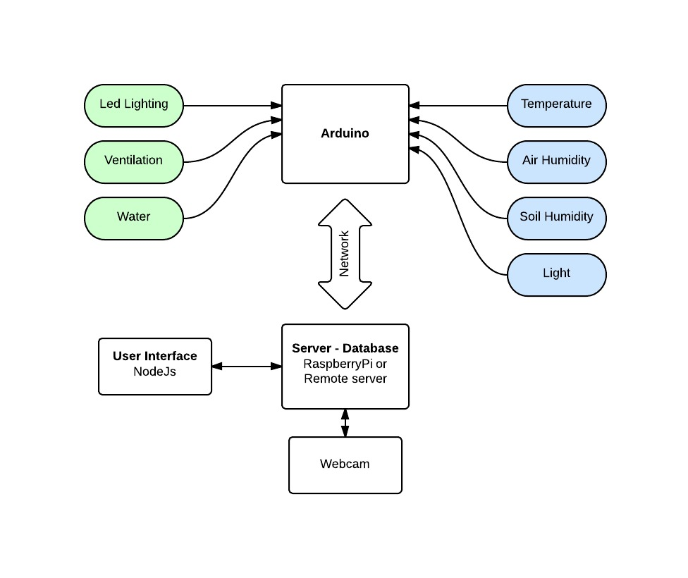

[Automated Green House] (http://link/)
=======================

This file describes the basic functionality of the Automated Green House.  [link] (http://link/)

Description
===========
[Automated Green House] (http://link/) is a system that allow person to grow vegetables in house. With the use of various sensors the system can control water, temperature and humidity and produce graphical views of the diferent variables.

Functionality principle
=======================

Trough the various sensors all data is recollected into a central unit or server. The data is then processed and showed to the user. With a pre-program or with a live humen interation the central unit will decide what to do with the diferent actuators. 

Circuit
=======

The hardware connection can be seen in this picture:

----------

Lighting
========

As lighting we are using some LED for theyr low consumption. We will use only as a support for lgihting in situation where the sun has low incidence on the plants.

Recent investigations on led lighting suggests that there are many possible configurations for every single type of plant. It has been proved that a powerful LED light will work for a variety of situations.

I'm also adding an array of UV leds as they help at the growing of the majority of plants and also has a desinfection action. 

Pictures: 

----------

Configuration
=============

----------

Use
===

----------

